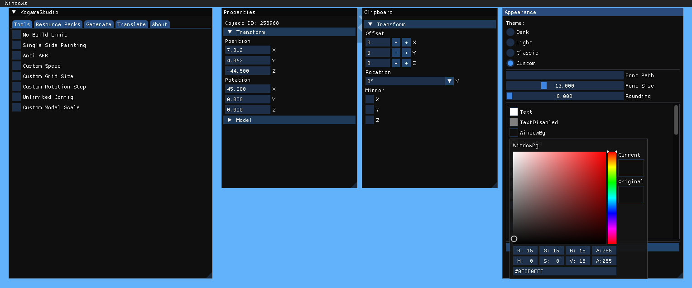

# KogamaStudio

A mod for KoGaMa that adds useful features to build mode.
  


## Installation

### Automatic (Recommended)
1. Download `KogamaStudio-Installer.exe`
2. Run installer and select server
3. Done!

### Manual Installation

#### Step 1: Install MelonLoader
1. Download latest **Nightly** build from https://melonwiki.xyz/
2. Run installer on your KoGaMa game

#### Step 2: Copy DLL files to Mods folder

Copy these 4 files to your Mods folder:
- `KogamaStudio.dll`
- `KogamaStudio-ImGui-Hook.dll`
- `KogamaModFramework.dll`

**For KogamaLauncher-WWW:**
```
%localappdata%\KogamaLauncher-WWW\Launcher\Standalone\Mods\
```

**For KogamaLauncher-BR:**
```
%localappdata%\KogamaLauncher-BR\Launcher\Standalone\Mods\
```

**For KogamaLauncher-Friends:**
```
%localappdata%\KogamaLauncher-Friends\Launcher\Standalone\Mods\
```

#### Step 3: Copy KogamaStudio folder

Copy the `KogamaStudio` folder to:
```
%localappdata%\KogamaStudio\
```

This folder contains ResourcePacks folder.

#### Step 4: Done!
Launch the game and press **F2** to open the menu.

## Requirements

- [MelonLoader](https://melonwiki.xyz/) - **Nightly build** (latest version required)

## Usage

- **F2** - Toggle menu
- Select tools in the menu

## Troubleshooting

### UI not appearing
If the mod loads but the menu doesn't show, your antivirus is likely blocking the **Direct3D 11** hook that renders the interface. Add KogamaStudio-ImGui-Hook.dll to your antivirus whitelist or temporarily disable it.

### Fog on project
The fog effect is a safety feature-MelonLoader has compatibility issues with KoGaMa, so fog prevents crashes in restricted areas. It will reduce when you enter the Shop.

## Known Issues

- Memory leak when reloading textures
- Occasional crashes (MelonLoader compatibility)
- False positives

## Credits

- [Sh0ckFR](https://github.com/Sh0ckFR/Universal-Dear-ImGui-Hook) - ImGui Hook
- [KogamaTools](https://github.com/Beckowl/KogamaTools) - Base code
- [Dear ImGui](https://github.com/ocornut/imgui) - UI Framework

## Support

[Discord Server](https://discord.gg/u6tKuP3k4M)

