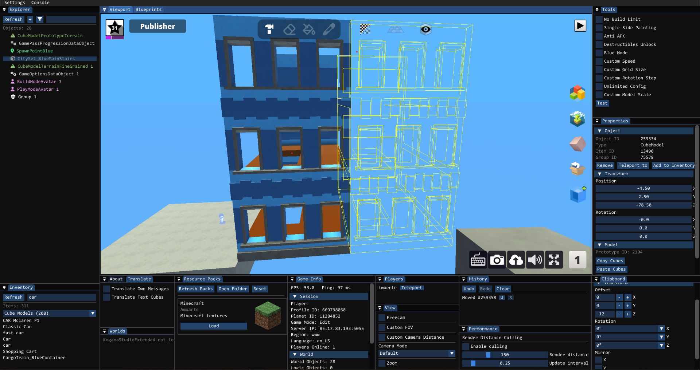

<h1>
     
</h1>

A mod for KoGaMa that adds useful features to build mode.
  

## Installation

### Automatic
1. Download [KogamaStudio-Installer.exe](https://github.com/imuarte/KogamaStudio/releases/download/v0.5.0/KogamaStudio-Installer.exe)
2. Run installer and select server
3. Done!

## Usage

- **F2** - Toggle menu
- Select tools in the menu

## Troubleshooting

### UI not appearing
If the mod loads but the menu doesn't show, your antivirus is likely blocking the **Direct3D 11** hook that renders the interface. Add KogamaStudio-ImGui-Hook.dll to your antivirus whitelist or temporarily disable it.

### Fog on project
The fog effect is a safety feature-BepInEx has compatibility issues with KoGaMa, so fog prevents crashes in restricted areas. It will reduce when you enter the Shop.

## Support
[Discord Server](https://discord.gg/u6tKuP3k4M)

